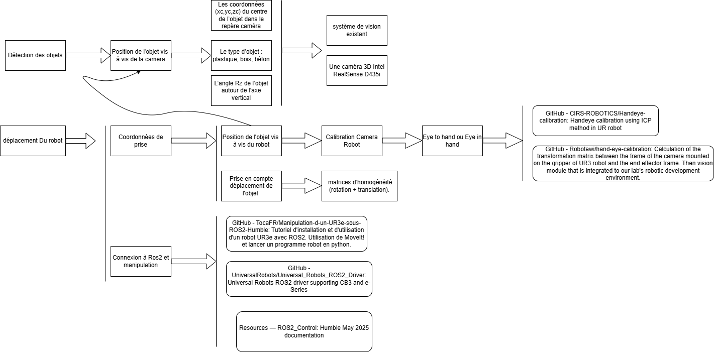
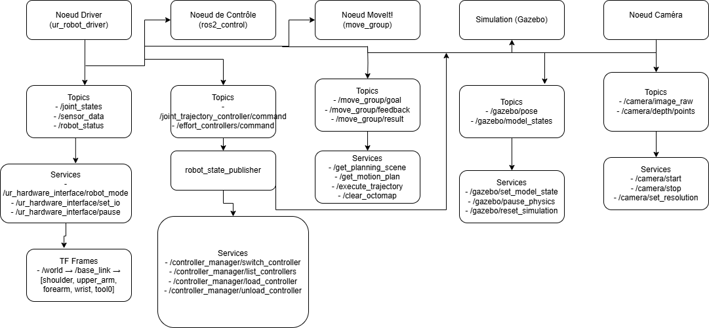

# Prise en Mouvement et Tri Dynamique par Robot UR3e et Vision 3D

## Présentation du Projet

Ce projet a pour but de développer une **solution ROS2** permettant à un bras robotique **UR3e** d’effectuer un **tri dynamique d’objets** sur un **convoyeur en mouvement**, grâce à un système de **vision 3D**.  
L’objectif est de localiser et trier différents types de **déchets de chantier** (plastique, bois, béton) en temps réel, malgré le déplacement constant du convoyeur.

---

## Dépendances et Environnement

### Dépendances principales :

- ROS2 Humble
- OpenCV
- Gazebo
- RViz2
- Python3

### Commandes d'installation de base :

```bash
# Créer un workspace ROS2
mkdir -p ~/ur3e_ws/src
cd ~/ur3e_ws/
colcon build
source install/setup.bash

# Installer les dépendances
sudo apt install ros-humble-vision-msgs ros-humble-cv-bridge ros-humble-image-transport python3-opencv

```
--- 


## Diagramme Fonctionnel

Ce diagramme illustre les grandes étapes du traitement, de la capture d’image à la commande robotique :



---

## Architecture ROS2

La structuration des différents nœuds, topics et services du projet est représentée visuellement dans l'image ci-dessous :



---

## Ressources de Référence

### [Universal Robots ROS2 Driver](https://github.com/UniversalRobots/Universal_Robots_ROS2_Driver)

Ce dépôt officiel fournit les pilotes ROS2 pour les bras UR (dont le UR3e). Il permet de **contrôler le robot via ROS2**, notamment en utilisant les interfaces `FollowJointTrajectory` et `JointState`. Ce sera le cœur de notre communication entre ROS2 et le matériel physique.

---

### [Manipulation d’un UR3e sous ROS2 Humble](https://github.com/TocaFR/Manipulation-d-un-UR3e-sous-ROS2-Humble)

Ce projet est un exemple concret de **manipulation d’un UR3e avec ROS2 Humble**, en utilisant le driver officiel et RViz2. Il montre comment configurer l’environnement, lancer le robot en simulation et envoyer des trajectoires. Très utile pour comprendre la **configuration de base** du robot dans un contexte ROS2.

---

### [Projet Yazilim Mimarileri - Robotique industrielle](https://github.com/hkutluca/yazilimmimarileri/tree/master)

Bien que plus généraliste, ce projet montre comment structurer une **architecture logicielle claire** autour d’un robot industriel. Il donne des idées sur l’organisation des **nodes, services et topics**, ainsi que la gestion de la vision et des mouvements dans un environnement ROS.

---

### [Camera Calibration – OpenCV + ROS](https://github.com/niconielsen32/camera-calibration/tree/main)

Ce dépôt explique comment **calibrer une caméra** (RGB ou stéréo) avec OpenCV et ROS. La calibration est cruciale pour obtenir des données précises sur la **position 3D des objets détectés**. Cette ressource est essentielle pour que notre système de vision 3D fonctionne correctement.

---


